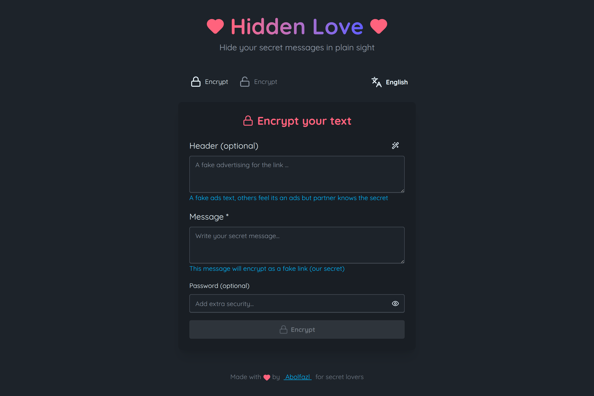

# 💕 Hidden Love

<div align="center">
  
</div>

<div align="center">
  
  
  
  
  
  <br />
  
  
</div>

<br />

> 🎭 **Hide secrets in plain sight. Everyone sees an ad. You see a love letter.**

Hidden Love encrypts your secret messages into ordinary-looking ad tracking links. To the outside world, it's just another `utm_source` spam. But between you and your special someone, it carries a hidden message that only they can unlock.

<br />

## 💡 The Idea

Ever wanted to send a secret message but worried someone might snoop? Hidden Love disguises your words as **boring advertisement links**. Imagine this:

```
https://www.amazon.com?q=SGVsbG9Xb3JsZA==
```

To a stranger scrolling through messages, this looks like an Amazon referral link. Annoying. Ignorable. **Invisible.**

But your partner knows better. They paste it into Hidden Love and discover:

> *"Meet me at sunset. I love you."* 💌

**Same link. Two completely different meanings.**

<br />

## ✨ Features

- 🎭 **Perfect Disguise** — Your secrets masquerade as ad tracking URLs
- 👀 **Undetectable** — Uses real domains (Amazon, Spotify, GitHub...) with realistic query params
- 🔐 **Password Protection** — Add an extra lock that only you two share
- 📦 **Smart Compression** — Shrinks messages using word dictionary for shorter links
- 🌙 **Dark Mode** — Beautiful DaisyUI themes for day and night
- 🌍 **Bilingual** — English & Persian (Farsi) with RTL support
- 📋 **One-Click Share** — Copy your disguised link instantly

<br />

## 🎯 How The Disguise Works

### The Outside World Sees:
```
Hi!!! All our products are 50%OFF!!!
Come on and join in our link !!

https://www.amazon.com?q=SGVsbG9Xb3JsZA==
```
Just a boring tracking link. Probably spam. Nobody cares.

### You & Your Partner Know:
1. Paste the link into Hidden Love
2. Enter your shared password (if set)
3. Reveal the secret message

```
💭 Header: Tonight
💌 Message: Meet me at our secret spot. Bring flowers.
```

<br />

## 🛠️ Tech Stack

| Tech | Purpose |
|------|---------|
| **React 19** | UI Framework |
| **TypeScript** | Type Safety |
| **Vite 5** | Build Tool |
| **Tailwind CSS 4** | Styling |
| **DaisyUI 5** | Components |
| **Lucide Icons** | Icons |

<br />

## 📦 Quick Start

```bash
git clone https://github.com/abolraj/hidden-love.git
cd hidden-love
pnpm install
pnpm run dev
```

<br />

## 🎭 Usage Flow

### Sender (Encrypt)
```
1. Write: "I miss you so much"
2. Add password: "our-cat-name"
3. Get link: https://spotify.com?q=SSQxICQ5
4. Send it casually in any chat
```

The link blends perfectly with other links. Zero suspicion.

### Receiver (Decrypt)
```
1. Receive: 
Ads Header

https://spotify.com?q=SSQxICQ5

2. Paste into Hidden Love
3. Enter: "our-cat-name"
4. Read: "I miss you so much" 💕
```

<br />

## 🔒 How It Secures Your Message

```
Your Message
    ↓
Sanitize & Compress (word dictionary)
    ↓
Encrypt with Password (if set)
    ↓
Encode to Base64
    ↓
Wrap in Ad URL Format
    ↓
https://real-domain.com?q=encoded-secret
```

<br />

## 🏗️ Project Structure

```
src/
├── pages/        # React pages
│   ├── EncryptPage    # Create secret links
│   ├── DecryptPage    # Reveal hidden messages
├── hooks/             # Business logic
│   ├── useEncryption  # Encode & disguise
│   ├── useDecryption  # Decode & reveal
│   └── useLang        # Language handler
├── utils/             # Pure functions
│   ├── compression    # Word dictionary
│   └── cipher         # String encryption
└── data/              # Static assets
    ├── words.json     # 50 common words
    └── websites.json  # 40+ real domains
```

<br />

## 🌍 Supported Languages

| Language | Code |
|----------|------|
| 🇬🇧 English | `en` |
| 🇮🇷 فارسی | `fa` |

<br />

## 🤝 Contributing

Got ideas to make the disguise even better? PRs welcome!

<br />

## 📄 License

[MIT](./LICENCE) © [Abolfazl Rajaee](https://abolfazlrajaee.ir)

<br />

---

<div align="center">
  <sub>🔒 Everyone sees an ad. You see a love letter.</sub>
  <br />
  <sub>by <a href="https://abolfazlrajaee.ir">Abolfazl Rajaee</a></sub>
</div>